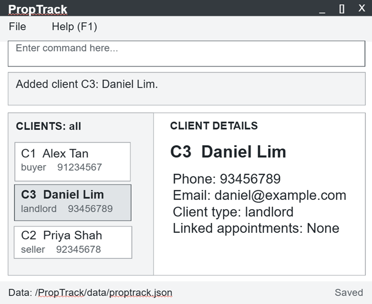

# PropTrack

PropTrack helps insurance and property agents manage a large, fast-changing list of client contacts.
It is optimized for agents who type fast, so adding, finding and updating a client takes one quick
command, and client data is never lost.

PropTrack is a desktop application (GUI plus CLI) written in Java, evolved from
[AddressBook Level 3](https://se-education.org/addressbook-level3) by
[se-education.org](https://se-education.org). Reused AB3 code and docs are credited to their
original authors; see [docs/AboutUs.md](docs/AboutUs.md) for our team.
