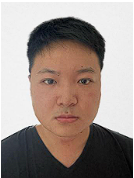
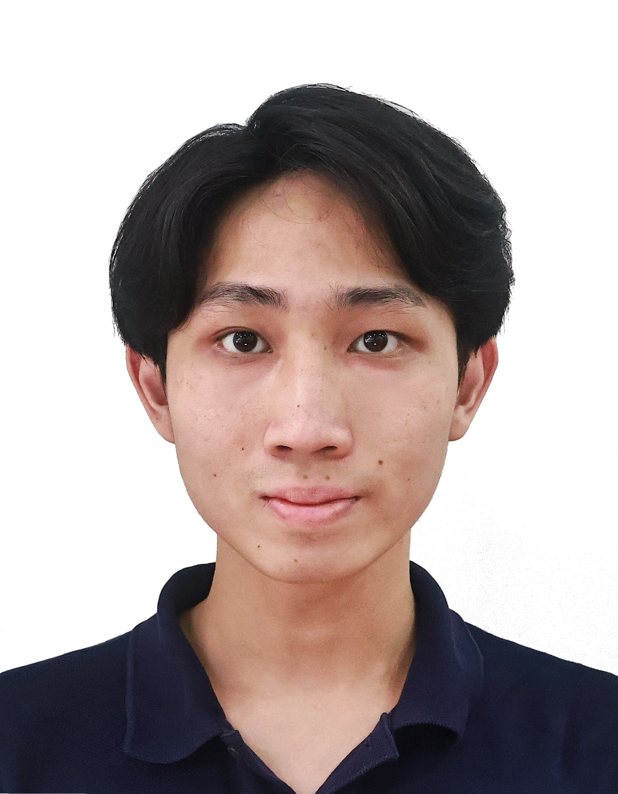
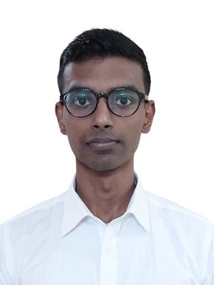

We are a team based in the [School of Computing, National University of Singapore](https://www.comp.nus.edu.sg).

You can reach us at the email `seer[at]comp.nus.edu.sg`

## Project team

### Jiang RongTang

[[github](https://github.com/JackyJiangCS)]

* Role: Project Advisor

### Dai Koi Yim

[[github](https://github.com/John-Dai-88)]

* Role: Developer
* Responsibilities: The development of Searching Clients & Adding Appointments

### Daniel Guan

[[github](https://github.com/itsDanielGuan)]

* Role: Developer
* Responsibilities: Adding, listing, and deleting appointments

### Jean Doe

[[github](http://github.com/johndoe)]
[[portfolio](team/johndoe.md)]

* Role: Developer
* Responsibilities: Dev Ops + Threading

### Keerthivasan152

[[homepage](https://keerthivasan152.github.io/ip/)]
[[github](https://github.com/Keerthivasan152)]

* Role: Developer
* Responsibilities: Client records (list) and data safety
